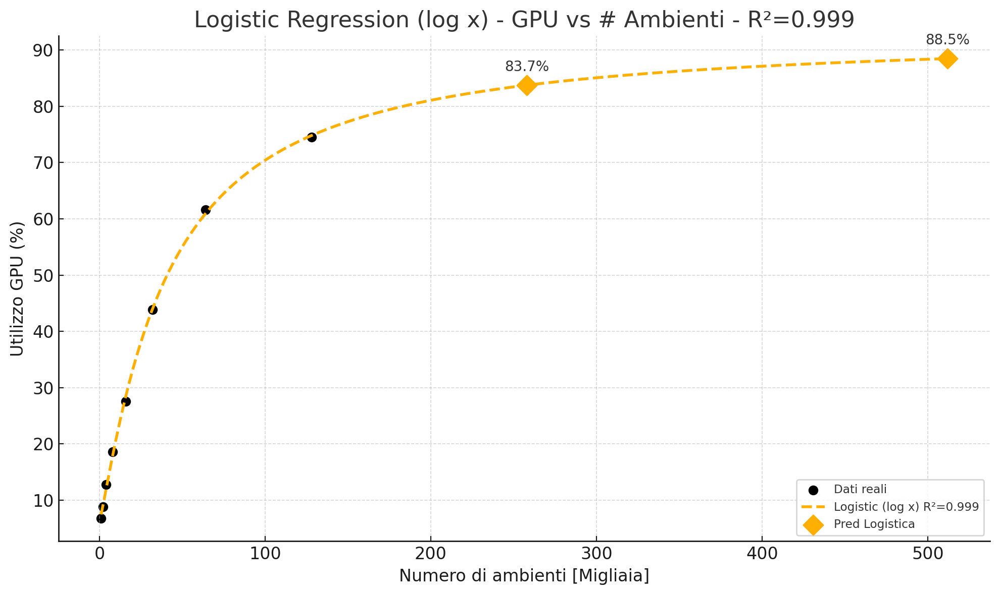
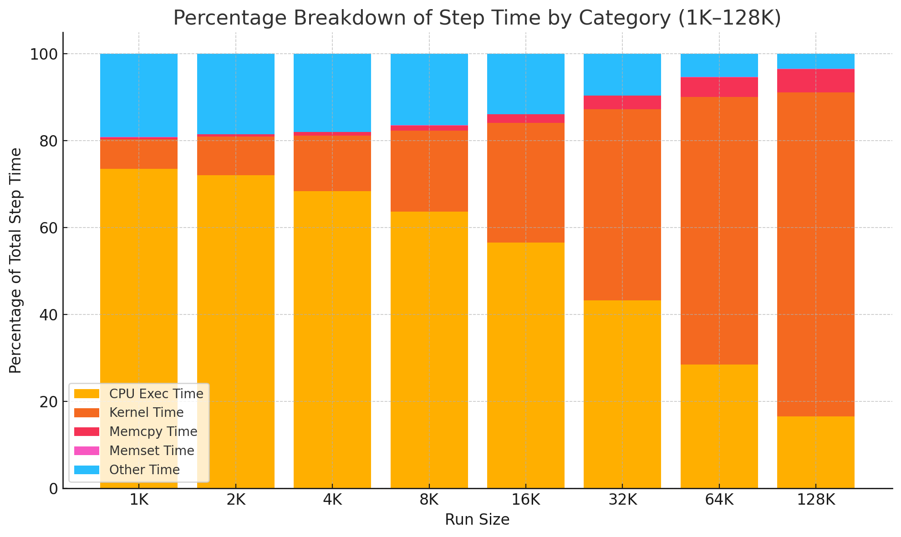

# ISAAC_SKRL_Integration

Il progetto mette in piedi una pipeline completa per addestrare un agente di controllo dell’assetto orbitale di un satellite, basata su due componenti chiave: la simulazione fisica parallela offerta da NVIDIA Isaac Gym e l’algoritmo PPO (Proximal Policy Optimization) fornito da SKRL.

---
## Code
### Configuration
Modulo per la definizione di tutti i parametri necessari al funzionamento del sistema: dalla gestione del seed e del dispositivo di calcolo (CPU/GPU), fino ai dettagli relativi agli ambienti paralleli. Include anche i percorsi al file URDF dell’asset, i parametri di simulazione e i setting dell’algoritmo PPO.

### Environment
Il modulo environment definisce classi che avviano e orchestrano in parallelo N istanze di simulazione con NVIDIA Isaac Gym: ciascuna classe si occupa di inizializzare gli ambienti caricando il modello URDF, controllare il ciclo di vita di ogni simulazione (reset, step, terminazione), raccogliere osservazioni e ricompense da tutte le istanze e fornire i dati necessari all'algoritmo di PPO.

### Rewards
Il sistema prevede un set modulare di funzioni di ricompensa che permettono l'implementazione di diverse strategie. Ogni funzione riceve in ingresso l’errore di orientamento, di velocità e di accelerazione rispetto al goal e restituisce un valore che rappresenta la reward.

### Utilities
Questo modulo raccoglie funzioni tensor-based per operazioni con quaternioni, come la generazione di quaternioni casuali o la differenza tra due quaternioni.

### Models
In questo modulo sono definite due reti neurali dense a tre layer: la policy, che trasforma le osservazioni nei parametri (media e log-std) di una gaussiana da cui si campionano le azioni, e la value, che – avendo accesso allo stato completo del sistema – stima il valore atteso. Questa stima viene poi confrontata con la ricompensa effettiva per ottenere l’advantage, cioè la misura di quanto l’azione scelta abbia superato (o meno) le aspettative.

### Asset URDF
Il file URDF descrive la geometria, la massa e le proprietà fisiche del satellite, permettendo a Isaac Gym di caricare un modello realistico e di applicare correttamente forze e coppie di controllo.

### Training
Lo script di training integra tutti i componenti: legge gli argomenti da riga di comando, costruisce l’ambiente, configura l’algoritmo PPO con i suoi iperparametri, istanzia i modelli di policy e value, impacchetta il tutto in un agente SKRL e avvia il ciclo di apprendimento.

---
## Scalability Results




## Video Demo


---
## 🖥️ Esecuzione Locale

1. Attiva l’ambiente Conda:

   ```bash
   conda activate rlgpu
   ```

2. Avvia il training:

   ```bash
   python -m satellite.train --reward-fn test
   ```

---

## 🌐 Esecuzione Remota con VNC

### 🔹 1. Sul Server Remoto

Esegui lo script `train.sh` specificando il numero di display (es: `1`), l'environment (es: `rlgpu`) e la reward function (es: `test`):

```bash
./train.sh 1 rlgpu test
```

---

### 🔹 2. Sul Computer Locale

#### a. Crea un tunnel SSH con port forwarding:

```bash
ssh -v -L 59000:localhost:$((5900 + <PORT>)) -N your_user@your.remote.ip
```

Sostituisci:

* `<PORT>` con il numero usato nel comando `train.sh`
* `your_user` con il tuo username SSH
* `your.remote.ip` con l’indirizzo IP del server remoto

#### b. Avvia VNC Viewer:

Connettiti a:

```bash
localhost:59000
```

Accederai al desktop GNOME remoto per monitorare l’allenamento.

---

## 📊 Monitoraggio con TensorBoard

### ✅ Avvio di TensorBoard sul server remoto

Assicurati che il training scriva i log in `./runs`, quindi avvia TensorBoard:

```bash
tensorboard --logdir ./runs --port 6006
```

### 🔁 Accesso remoto a TensorBoard da Windows (PowerShell)

Apri PowerShell e crea un tunnel SSH:

```bash
ssh -L 59001:localhost:6006 -N your_user@your.remote.ip
```

Poi apri il browser e visita:

```bash
http://localhost:59001
```

Vedrai la dashboard di TensorBoard in esecuzione sul server remoto.

---

## ⚙️ Installazione Miniconda & Isaac Gym

### ✅ Prerequisiti

* Sistema operativo: Linux x86\_64
* Strumenti richiesti: `wget`, `unzip` e/o `tar`

### 1️⃣ Installazione di Miniconda

```bash
mkdir -p ~/miniconda3
wget https://repo.anaconda.com/miniconda/Miniconda3-latest-Linux-x86_64.sh -O ~/miniconda3/miniconda.sh
bash ~/miniconda3/miniconda.sh -b -u -p ~/miniconda3
rm ~/miniconda3/miniconda.sh
~/miniconda3/bin/conda init bash
```

### 2️⃣ Download di Isaac Gym

```bash
tar -xf IsaacGym_Preview_4_Package.tar.gz
```

Estrai il pacchetto nella directory corrente.

### 3️⃣ Edit: rlgpu_conda_env.yml

```bash
 name: rlgpu
 channels:
   - pytorch
   - conda-forge
   - defaults
 dependencies:
-  - python=3.7
+  - python=3.8
   - pytorch=1.8.1
   - torchvision=0.9.1
   - cudatoolkit=11.1
   - pyyaml>=5.3.1
   - scipy>=1.5.0
   - tensorboard>=2.2.1
+  - mkl=2024.0
```

### 4️⃣ Installazione dell’Ambiente Isaac Gym

```bash
cd isaacgym
./create_conda_env_rlgpu.sh
```

Lo script creerà l’ambiente Conda `rlgpu` e installerà tutte le dipendenze necessarie.

### 5️⃣ Attivazione dell’Ambiente

```bash
conda activate rlgpu
```

## ⚙️ Installazione SKRL

```bash
conda activate rlgpu
pip install skrl["torch"]
```

## ⚙️ Opzionale per il funzionamento della GPU pipeline

```bash
export VK_ICD_FILENAMES=/usr/share/vulkan/icd.d/nvidia_icd.json
```

## ⚙️ Verifica dell’Installazione

```bash
conda activate rlgpu
cd isaacgym/python/examples
python joint_monkey.py
```

Se lo script si avvia correttamente, l’installazione è andata a buon fine.

## ⚙️ Opt. Installa tensorboard nell'environment base

```bash
conda activate base
pip install tensorboard
pip install standard-imghdr
```
## ⚙️ Opt. Installa tensorboard torch profiler

```bash
conda activate base
pip install torch_tb_profiler
conda activate rlgpu
pip install torch_tb_profiler
```

---
